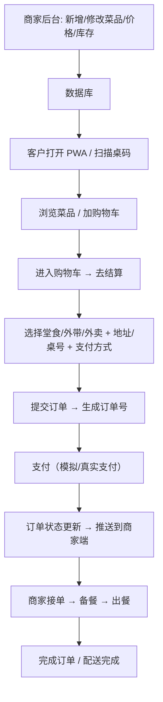

# 云栖浅食 · 企业级 PWA 点餐套装 — 产品需求文档 (PRD)

## 1. 产品概述
云栖浅食是一套面向连锁餐饮企业的完整 PWA 点餐解决方案，包含两个独立应用：客户可安装使用的**点餐小程序**与商家**后台管理工具**，两者共享同一数据库与业务后端。产品主打轻食、健康饮食定位，强调优雅、纯净、现代的 2026 企业级视觉语言，同时适配桌面与移动端窗口。

- 核心目标：为餐厅提供开箱即用、可持续迭代的数字化点餐与运营管理平台；为顾客提供一键安装、可离线浏览、体验顺滑的点餐 PWA。
- 市场价值：替代传统 POS + 微信点餐组合，降低部署成本，品牌自主可控，数据私有化部署友好。

---

## 2. 核心功能

### 2.1 用户角色

| 角色 | 注册/登录方式 | 核心权限 |
|------|----------------|----------|
| 客户 (Customer) | 手机号验证码 / 微信登录 / 匿名下单 | 浏览菜品、加购物车、下单、支付、查看订单、收藏 |
| 商家管理员 (Merchant Admin) | 邮箱密码 / 员工工号密码 | 菜品/分类/库存/价格/订单/餐桌/用户/门店/数据报表 管理 |
| 店员 (Staff) | 工号登录 | 接单、出餐、配送状态更新、查看订单 |

### 2.2 功能模块

**客户 PWA（yunqi-customer）**:
1. 首页 / 品牌展示：轮播 Banner、推荐菜品、限时优惠、分类快捷入口
2. 菜单页：分类筛选、搜索、辣度/规格选择、加入购物车、推荐关联菜品
3. 购物车：数量增减、规格修改、备注、合计、优惠计算
4. 下单页：选择堂食/外带/外卖、餐桌扫码、地址、优惠券、支付方式选择
5. 订单列表 / 详情：状态时间线、配送进度、再来一单
6. 个人中心：收藏、地址管理、优惠券、设置

**商家后台 PWA（yunqi-merchant）**:
1. 仪表盘：今日营收、订单数、客单价、热销 Top、实时订单动向图表
2. 菜品管理：分类 CRUD、菜品 CRUD、图片上传、规格管理、标签、库存、上下架
3. 订单管理：订单列表、筛选、状态流转（待支付 → 已支付 → 备餐 → 出餐 → 已完成 / 已取消）、退款
4. 餐桌管理：桌号、座位数、二维码生成、使用状态
5. 用户 / 会员管理：会员列表、等级、积分、消费记录
6. 门店管理：门店信息、营业时间、配送范围
7. 员工管理：账号、权限、岗位
8. 数据报表：按日/周/月/季度营收柱状图、饼图、趋势折线图、菜品热力图
9. 系统设置：支付配置、打印模板、主题（浅色/深色）

---

### 2.3 页面详情

| 应用 | 页面 | 模块 | 功能描述 |
|------|------|------|---------|
| Customer | 首页 | Hero Banner、今日推荐、分类快捷、限时优惠 | 品牌视觉 + 核心内容聚合 |
| Customer | 菜单页 | 分类侧栏、菜品卡片、规格选择弹窗、搜索框、购物车浮窗 | 核心浏览下单动作 |
| Customer | 购物车 | 商品列表、数量增减、备注输入、优惠券选择、合计栏、去结算 | 下单入口 |
| Customer | 下单页 | 堂食/外带/外卖切换、餐桌号、配送地址、支付方式、下单按钮 | 结算动作 |
| Customer | 订单列表 | 状态 tabs、时间线、卡片列表 | 订单浏览 |
| Customer | 订单详情 | 订单明细、状态时间线、再来一单 | 订单追踪 |
| Customer | 个人中心 | 用户信息、收藏、地址、优惠券、设置 | 个人管理 |
| Merchant | 登录页 | Logo、工号/邮箱、密码、登录按钮 | 身份验证 |
| Merchant | 仪表盘 | KPI 卡片、订单趋势图、热销 Top、实时订单流 | 数据一览 |
| Merchant | 菜品管理 | 表格/卡片、筛选、CRUD 弹窗 | 菜品维护 |
| Merchant | 订单管理 | 表格、状态流转、详情抽屉 | 订单运营 |
| Merchant | 餐桌管理 | 桌位平面图、二维码、状态切换 | 桌位管理 |
| Merchant | 会员管理 | 列表、详情、等级、积分 | CRM |
| Merchant | 数据报表 | 多图组合、筛选、导出 | 数据洞察 |
| Merchant | 系统设置 | 门店/支付/打印/主题 | 配置 |

---

## 3. 核心流程

---

## 4. 用户界面设计

### 4.1 设计风格（2026 企业级 · 轻食美学）

- **主色（Primary）**: `#2E7D6B` 深翠绿 — 呼应轻食、自然、健康
- **辅色（Accent）**: `#FFB26B` 暖橘 — 点缀按钮与行动号召
- **中性色系**: 以 `#F5F1EA`（米白）为画布；`#1A1A1A` 深墨黑为字色；灰阶 `#E8E4DD / #8A857A`
- **风格关键词**: 极简留白 / 现代衬线与无衬线组合 / 微妙玻璃拟态 / 几何线条装饰 / 柔和阴影
- **字体组合**:
  - 标题：`"Noto Serif SC"` 或 `"DM Serif Display"`（中文/英文标题）
  - 正文：`"Inter"`、`"Noto Sans SC"`
- **按钮**: 完全圆角 12px，主色填充 + 1px 同色描边，hover 时向上微浮 + 柔和阴影加深
- **卡片**: 圆角 16px，细腻 `0 2px 12px rgba(0,0,0,0.04)` 阴影 + 悬停时 `0 8px 28px rgba(46,125,107,0.08)`
- **图标**: `lucide-react`，线条 1.5px，统一 20px
- **动效**: `ease-out cubic-bezier(0.22, 1, 0.36, 1)`；过渡时长 180–320ms；页面进入采用错位透明+上升
- **响应式**: Mobile-first，断点 `sm:640 / md:768 / lg:1024 / xl:1280`；桌面端使用双列/三列栅格；移动端单列+底部 tabbar

### 4.2 页面设计一览

| 应用 | 页面 | 布局 | 颜色 | 动画 |
|------|------|------|------|------|
| Customer | 首页 | 顶部品牌 bar + Hero + 分类横滑 + 网格菜品卡 | 米白底 + 翠绿主色 | 菜品卡 stagger 进入 |
| Customer | 菜单页 | 左侧固定分类 / 移动端顶部 tab；右侧网格菜品卡 | 米白 + 翠绿高亮 | 分类切换淡入 |
| Customer | 购物车 | 卡片列表 + 底部固定合计栏 | 米白 + 暖橘结算按钮 | 数量增减带缩放 |
| Customer | 订单详情 | 时间线 + 卡片列表 | 灰阶时间线 | 状态高亮闪烁 |
| Merchant | 仪表盘 | 左侧导航 + 顶部 breadcrumb + 4 列 KPI + 2 列图表 | 深色 sidebar + 浅色主区 | 数字滚动计数 |
| Merchant | 菜品/订单管理 | 顶部搜索筛选 + 表格 / 卡片视图 | 标准数据色 | 抽屉式侧边详情 |

### 4.3 响应式设计

- **桌面端 (≥1024px)**:
  - Customer：两列菜单布局，购物车右侧抽屉；导航顶栏
  - Merchant：左侧侧栏导航 + 宽内容区，表格显示完整字段
- **平板 (768–1024px)**:
  - Customer：两列菜品卡网格，顶栏收起为汉堡菜单
  - Merchant：侧栏可折叠为图标
- **移动端 (<768px)**:
  - Customer：单列菜品卡，底部 tabbar（首页 / 菜单 / 购物车 / 订单 / 我的）
  - Merchant：顶部 tab，内容区域滚动，表格横向滚动

### 4.4 PWA 安装与离线体验

- 两个应用均具备独立 `manifest.webmanifest`、独立图标（192/512）
- Service Worker 缓存核心 shell、静态资源与最近菜单数据
- 离线时可浏览已缓存菜单与历史订单
- 首次访问弹出安装引导提示（iOS 添加到主屏幕、Android 安装）

---

## 5. 验收标准

- 两个 PWA 均可通过浏览器安装为桌面/移动应用，可离线启动
- 数据端完全共享，后台修改菜品在客户端实时可见
- 下单流程完整闭环：加购 → 下单 → 支付 → 状态变更 → 后台实时接收
- 所有页面均通过桌面/移动端断点验证
- 核心视觉遵循 2026 企业级设计规范（主绿辅橘、极简留白、衬线+无衬线混排）
