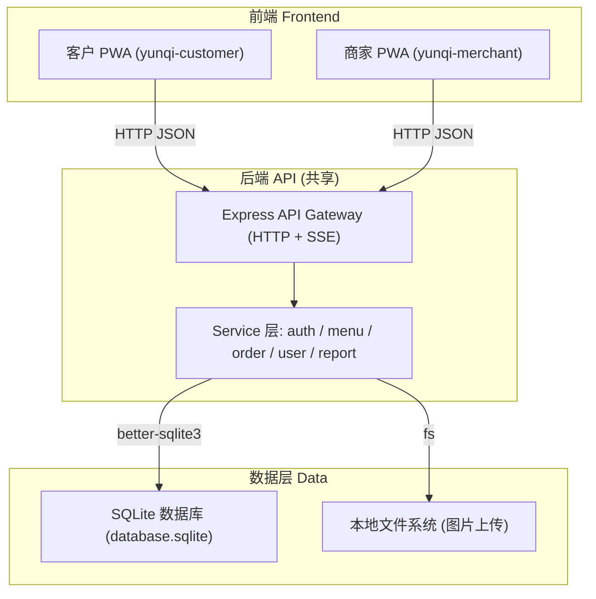

# 云栖浅食 · 企业级 PWA 点餐套装 — 技术架构文档

## 1. 架构设计



- 共享同一个 Express 后端与同一个 SQLite 数据库文件
- 两个前端应用由不同 Vite `root` 构建，运行在同域下的 `/customer` 与 `/merchant` 路径（或独立部署）
- 实时更新通过 SSE（Server-Sent Events）实现订单状态推送

---

## 2. 技术描述

| 层 | 技术栈 |
|---|--------|
| 前端 (Customer / Merchant) | **React 18 + TypeScript + Vite 5 + TailwindCSS 3 + Zustand 4 + lucide-react** |
| 后端 | **Express 4 + TypeScript** |
| 数据库 | **SQLite**（通过 `better-sqlite3` 驱动；可平滑迁移到 PostgreSQL） |
| 实时 | **SSE (Server-Sent Events)** |
| PWA | **Web App Manifest + Service Worker（手写）** |
| 图表 | **recharts** |
| 路由 | **react-router-dom v6** |
| 密码 | **bcrypt** |
| 开发启动 | **concurrently** 同时启动 后端 + 两个前端 dev server |

### 关键依赖版本

- `react@^18.2.0`, `react-dom@^18.2.0`
- `react-router-dom@^6.22.0`
- `vite@^5.2.0`
- `typescript@^5.4.0`
- `tailwindcss@^3.4.0`, `postcss@^8.4.0`, `autoprefixer@^10.4.0`
- `zustand@^4.5.0`
- `lucide-react@^0.350.0`
- `recharts@^2.12.0`
- `express@^4.18.0`
- `better-sqlite3@^11.3.0`
- `bcrypt@^5.1.0`
- `multer@^1.4.5-lts.1`

---

## 3. 目录结构

```
/workspace (yunqi-light-meal)
├─ apps/
│   ├─ customer/              ── 客户点餐 PWA
│   │   ├─ index.html
│   │   ├─ manifest.webmanifest
│   │   ├─ sw.js
│   │   ├─ vite.config.ts
│   │   ├─ tsconfig.json
│   │   ├─ tailwind.config.js
│   │   └─ src/
│   │       ├─ main.tsx
│   │       ├─ App.tsx
│   │       ├─ styles.css
│   │       ├─ router.tsx
│   │       ├─ pages/        (首页/菜单/购物车/下单/订单列表/订单详情/个人中心)
│   │       ├─ components/   (顶栏/底栏/菜品卡/购物车抽屉/空态/加载骨架)
│   │       ├─ stores/       (cart.ts, user.ts, menu.ts)
│   │       ├─ hooks/        (useApi, useToast...)
│   │       └─ api/          (client.ts → 封装 fetch 到 /api)
│   │
│   └─ merchant/              ── 商家后台 PWA
│       ├─ index.html
│       ├─ manifest.webmanifest
│       ├─ sw.js
│       ├─ vite.config.ts
│       ├─ tsconfig.json
│       ├─ tailwind.config.js
│       └─ src/
│           ├─ main.tsx
│           ├─ App.tsx
│           ├─ styles.css
│           ├─ router.tsx
│           ├─ pages/        (登录/仪表盘/菜品/分类/订单/餐桌/会员/员工/报表/设置)
│           ├─ components/   (Sidebar, Topbar, 数据卡, 图表, 模态框, 表格)
│           ├─ stores/       (auth.ts, ui.ts)
│           └─ api/
│
├─ api/                        ── 共享 Express 后端
│   ├─ tsconfig.json
│   ├─ src/
│   │   ├─ index.ts           (入口, SSE, 中间件)
│   │   ├─ db.ts              (better-sqlite3 初始化 + 建表)
│   │   ├─ seed.ts            (初始数据)
│   │   ├─ routes/            (auth, categories, dishes, orders, tables,
│   │   │                      users, staff, reports, settings, sse)
│   │   ├─ middleware/        (auth, upload)
│   │   └─ types.ts
│   └─ data/
│      └─ database.sqlite     (首次启动自动创建)
│
├─ shared/                     ── 前后端共享类型
│   └─ types.ts
│
├─ package.json                (根: scripts + workspace)
├─ .gitignore
└─ README.md
```

---

## 4. 路由定义

### Customer PWA (`/customer/index.html` → 实际 `customer/`)
| 路由 | 页面 |
|------|------|
| `/` | 首页 |
| `/menu` | 菜单页 |
| `/menu/:categoryId` | 分类菜单 |
| `/cart` | 购物车 |
| `/checkout` | 下单页 |
| `/orders` | 订单列表 |
| `/orders/:id` | 订单详情 |
| `/profile` | 个人中心 |
| `/login` | 登录 / 注册 |

### Merchant PWA (`/merchant/`)
| 路由 | 页面 |
|------|------|
| `/login` | 登录 |
| `/dashboard` | 仪表盘 |
| `/dishes` | 菜品管理 |
| `/categories` | 分类管理 |
| `/orders` | 订单管理 |
| `/orders/:id` | 订单详情 |
| `/tables` | 餐桌管理 |
| `/members` | 会员管理 |
| `/staff` | 员工管理 |
| `/reports` | 数据报表 |
| `/settings` | 系统设置 |

### 后端 API (`/api/*`)

| 方法 | 路径 | 作用 |
|------|------|------|
| POST | `/api/auth/login` | 商家/员工登录 |
| POST | `/api/auth/customer-login` | 客户手机号/验证码登录 |
| POST | `/api/auth/register` | 注册 |
| GET  | `/api/categories` | 分类列表 |
| POST | `/api/categories` | 新增分类 |
| PATCH| `/api/categories/:id` | 更新分类 |
| DELETE| `/api/categories/:id` | 删除分类 |
| GET  | `/api/dishes` | 菜品列表（支持 categoryId / keyword / 分页） |
| GET  | `/api/dishes/:id` | 菜品详情 |
| POST | `/api/dishes` | 新增菜品（含图片上传） |
| PATCH| `/api/dishes/:id` | 更新菜品 |
| DELETE| `/api/dishes/:id` | 删除菜品 |
| GET  | `/api/orders` | 订单列表（按角色过滤） |
| GET  | `/api/orders/:id` | 订单详情 |
| POST | `/api/orders` | 客户下单 |
| PATCH| `/api/orders/:id/status` | 更新订单状态 |
| GET  | `/api/tables` | 餐桌列表 |
| POST | `/api/tables` | 新增餐桌 |
| PATCH| `/api/tables/:id` | 更新餐桌状态 |
| GET  | `/api/members` | 会员列表 |
| GET  | `/api/staff` | 员工列表 |
| POST | `/api/staff` | 新增员工 |
| GET  | `/api/reports/summary` | 汇总 |
| GET  | `/api/reports/trend` | 趋势数据 |
| GET  | `/api/reports/dishes` | 菜品排行 |
| GET  | `/api/stream` | SSE 实时事件流 |
| POST | `/api/upload/image` | 图片上传 (multer) |
| GET  | `/uploads/*` | 静态图片服务 |

---

## 5. 数据模型

### 5.1 ER 图

```mermaid
erDiagram
    CATEGORY {
        int id PK
        string name
        string slug
        int sort_order
        string image
        boolean active
    }
    DISH {
        int id PK
        int category_id FK
        string name
        string description
        decimal price
        string image
        string tags
        string specs_json
        int stock
        boolean active
        boolean recommended
        int sort_order
        datetime created_at
    }
    CUSTOMER {
        int id PK
        string phone
        string name
        string avatar
        int points
        string level
        datetime created_at
    }
    STAFF {
        int id PK
        string username
        string password_hash
        string name
        string role
        boolean active
    }
    "ORDER" {
        int id PK
        string order_no
        int customer_id FK
        string table_no
        string order_type
        string status
        decimal total
        string payment_method
        string address
        string remark
        datetime created_at
        datetime updated_at
    }
    ORDER_ITEM {
        int id PK
        int order_id FK
        int dish_id FK
        string dish_name
        decimal price
        int quantity
        string spec
        string remark
    }
    TABLES {
        int id PK
        string code
        int seats
        string status
    }

    CATEGORY ||--o{ DISH : "分类下"
    CUSTOMER ||--o{ "ORDER" : "下单"
    "ORDER" ||--o{ ORDER_ITEM : "含"
    DISH ||--o{ ORDER_ITEM : ""
    "ORDER" o--o| TABLES : "关联"
```

### 5.2 DDL（SQLite）

```sql
CREATE TABLE IF NOT EXISTS categories (
  id INTEGER PRIMARY KEY AUTOINCREMENT,
  name TEXT NOT NULL,
  slug TEXT UNIQUE,
  sort_order INTEGER DEFAULT 0,
  image TEXT,
  active INTEGER DEFAULT 1
);

CREATE TABLE IF NOT EXISTS dishes (
  id INTEGER PRIMARY KEY AUTOINCREMENT,
  category_id INTEGER,
  name TEXT NOT NULL,
  description TEXT,
  price REAL NOT NULL DEFAULT 0,
  image TEXT,
  tags TEXT,
  specs TEXT,         -- JSON: [{name, priceDelta, options:[...]}]
  stock INTEGER DEFAULT 999,
  active INTEGER DEFAULT 1,
  recommended INTEGER DEFAULT 0,
  sort_order INTEGER DEFAULT 0,
  created_at TEXT DEFAULT (datetime('now','localtime'))
);

CREATE TABLE IF NOT EXISTS customers (
  id INTEGER PRIMARY KEY AUTOINCREMENT,
  phone TEXT UNIQUE,
  name TEXT,
  avatar TEXT,
  points INTEGER DEFAULT 0,
  level TEXT DEFAULT '普通',
  created_at TEXT DEFAULT (datetime('now','localtime'))
);

CREATE TABLE IF NOT EXISTS staff (
  id INTEGER PRIMARY KEY AUTOINCREMENT,
  username TEXT UNIQUE,
  password_hash TEXT NOT NULL,
  name TEXT,
  role TEXT DEFAULT 'staff',      -- admin / staff
  active INTEGER DEFAULT 1
);

CREATE TABLE IF NOT EXISTS orders (
  id INTEGER PRIMARY KEY AUTOINCREMENT,
  order_no TEXT UNIQUE,
  customer_id INTEGER,
  table_no TEXT,
  order_type TEXT DEFAULT 'dine', -- dine / takeaway / delivery
  status TEXT DEFAULT 'pending',  -- pending / paid / preparing / ready / completed / cancelled
  total REAL DEFAULT 0,
  payment_method TEXT,            -- wechat / alipay / cash / card
  address TEXT,
  remark TEXT,
  created_at TEXT DEFAULT (datetime('now','localtime')),
  updated_at TEXT DEFAULT (datetime('now','localtime'))
);

CREATE TABLE IF NOT EXISTS order_items (
  id INTEGER PRIMARY KEY AUTOINCREMENT,
  order_id INTEGER NOT NULL,
  dish_id INTEGER,
  dish_name TEXT,
  price REAL,
  quantity INTEGER DEFAULT 1,
  spec TEXT,
  remark TEXT
);

CREATE TABLE IF NOT EXISTS tables (
  id INTEGER PRIMARY KEY AUTOINCREMENT,
  code TEXT UNIQUE,
  seats INTEGER DEFAULT 2,
  status TEXT DEFAULT 'free'      -- free / occupied / reserved
);

CREATE INDEX IF NOT EXISTS idx_orders_status  ON orders(status);
CREATE INDEX IF NOT EXISTS idx_orders_created ON orders(created_at DESC);
CREATE INDEX IF NOT EXISTS idx_dishes_cat     ON dishes(category_id);
```

---

## 6. PWA 实现要点

### manifest.webmanifest
```json
{
  "name": "云栖浅食 · 点餐",
  "short_name": "云栖浅食",
  "start_url": "./",
  "display": "standalone",
  "background_color": "#F5F1EA",
  "theme_color": "#2E7D6B",
  "icons": [
    { "src": "/icons/icon-192.png", "sizes": "192x192", "type": "image/png", "purpose": "any maskable" },
    { "src": "/icons/icon-512.png", "sizes": "512x512", "type": "image/png", "purpose": "any maskable" }
  ]
}
```
> 由于本仓库为代码仓库，图标文件在首次构建前为占位；建议后续用 Figma 导出替换 `/icons/*.png`。

### Service Worker（sw.js）
- 版本化缓存：`v1-cache-shell`、`v1-cache-api`
- `install` 预缓存 shell（index.html、关键 JS/CSS、图标）
- `fetch` 策略：
  - 静态资源 → stale-while-revalidate
  - `/api/dishes*`、`/api/categories*` → stale-while-revalidate
  - 其他 GET 请求 → network-first，失败回退缓存
- `activate` 清理旧版本缓存
- 商家端与客户端各自的 SW 互不干扰

---

## 7. 安全与授权

- **商家/员工登录**：使用 `username + password_hash(bcrypt)`，登录后返回 JWT（自签 HS256，exp 7 天），存于 `localStorage`。
- **客户登录**：默认支持"游客下单"（写入 `customer_id = NULL` 或自动创建匿名客户），也支持手机号登录（开发环境演示验证码为 `1234`）。
- 所有写操作接口均需携带 `Authorization: Bearer <token>` 头，或在 cookies 中。
- 图片上传限制 `image/*`，单文件 `5MB`，存 `api/public/uploads/`。

---

## 8. 启动脚本

根 `package.json` 中 `scripts`：

```json
{
  "dev": "concurrently -n API,CUST,MERCH -c green.bold,cyan.bold,magenta.bold \"npm:dev:api\" \"npm:dev:customer\" \"npm:dev:merchant\"",
  "dev:api": "cd api && npm run dev",
  "dev:customer": "cd apps/customer && npm run dev",
  "dev:merchant": "cd apps/merchant && npm run dev",
  "build": "npm run build:customer && npm run build:merchant",
  "build:customer": "cd apps/customer && npm run build",
  "build:merchant": "cd apps/merchant && npm run build",
  "start": "cd api && npm start"
}
```

- API 默认端口 `4000`
- Customer dev server: `5173`
- Merchant dev server: `5174`
- 生产构建时两个前端 build 产物由 API 静态托管在 `/customer` 与 `/merchant`

---

## 9. 设计 Tokens（Tailwind 主题扩展）

```js
theme: {
  extend: {
    colors: {
      brand: {
        50:  '#F1F8F5',
        100: '#DCEDE5',
        200: '#B5DBCB',
        300: '#86C3AA',
        400: '#57A989',
        500: '#2E7D6B',   // 主色
        600: '#236555',
        700: '#1B4F42',
        800: '#153D34',
        900: '#0F2C26',
      },
      accent: {
        500: '#FFB26B',   // 暖橘
        600: '#F59947',
      },
      canvas: '#F5F1EA',   // 米白
      ink:    '#1A1A1A',
      muted:  '#8A857A',
    },
    fontFamily: {
      serif: ['"DM Serif Display"', '"Noto Serif SC"', 'serif'],
      sans:  ['Inter', '"Noto Sans SC"', 'system-ui', 'sans-serif'],
    },
    boxShadow: {
      soft: '0 2px 12px rgba(0,0,0,0.04)',
      glow: '0 8px 28px rgba(46,125,107,0.10)',
    },
    borderRadius: {
      xl2: '16px',
    },
  }
}
```
